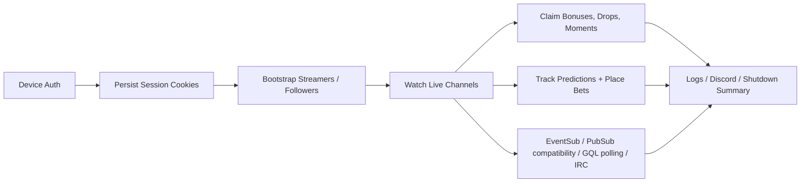

# Twitch Miner Rust

An unofficial Twitch channel points miner rebuilt in Rust as a rewrite of [0x8fv/Twitch-Channel-Points-Miner](https://github.com/0x8fv/Twitch-Channel-Points-Miner), with the goal of keeping the useful behavior while making the codebase easier to reason about, test, ship, and operate.

This project keeps the behavior that matters in day-to-day use:

- device-code login with persisted cookies
- automatic bonus chest claims
- minute-watched farming and streak handling
- prediction betting with configurable strategies and delays
- campaign-aware drop-priority watching and claims, raid observation,
  chat-presence, Discord notifications, and privacy-aware logging
- Docker-friendly runtime layout and multi-arch delivery paths

It is not a toy rewrite. The workspace is split into focused crates, the Twitch parsers are fixture-backed, and the runtime is organized around a single-writer state model instead of a pile of ad-hoc side effects.

## Why this rewrite exists

The point was not to rewrite working behavior for the sake of language preference. The point was to keep the miner useful while making the internals less fragile.

- `tm-runtime` owns mutable state instead of scattering it across the process
- `tm-domain` keeps decision logic pure and testable
- `tm-twitch`, `tm-events`, `tm-pubsub`, and `tm-irc` isolate protocol boundaries
- `tm-auth` and `tm-config` make startup, persistence, and local operation predictable
- `tm-observability` keeps logging, anonymization, and Discord plumbing out of the hot path

## What it does



## Quick start

### Local

```powershell
cd Twitch-Miner-Rust
cargo run -p tm-app -- --config ./data/config.json --data-dir ./data
```

On first launch:

1. Set `username` in `data/config.json`.
2. Start the app.
3. Open `https://www.twitch.tv/activate`.
4. Enter the device code shown in the terminal.
5. Wait for cookies to be written to `data/cookies/<username>.json`.

### Docker

```powershell
cd Twitch-Miner-Rust
docker compose up --build
```

The container layout is centered on `/data`:

- `/data/config.json`
- `/data/cookies/<username>.json`
- `/data/log/*.log`

Published images are static Rust binaries in a `scratch` runtime. The image has no shell, package manager, or OS certificate bundle; TLS trust comes from the Rust dependencies configured in the app. The runtime contract stays centered on `/data` with `TCPM_DATA_DIR=/data`, `TCPM_CONFIG=/data/config.json`, and `SIGTERM` shutdown.

There is also a named-volume variant in [deploy/docker-compose.volume.yml](deploy/docker-compose.volume.yml).

For Linux bind mounts, make sure the mounted data directory and any existing cookie files stay writable by the container user. The Raspberry Pi example in [deploy/docker-compose.rpi.yml](deploy/docker-compose.rpi.yml) pins a host UID/GID override for that reason.

GitHub Actions builds and publishes the multi-arch GHCR image on pushes to
`main`. A signed `v*` tag promotes the already-tested manifest for that exact
commit without rebuilding it, and fails if the release tag does not retain the
same digest. For local Docker validation, `scripts/build-multiarch.ps1` builds
and loads a single local-platform image by default; pass `-Push` to build and
publish `linux/amd64`, `linux/arm64`, and `linux/arm/v7`.

Deploy published images by immutable digest. See [docs/release-process.md](docs/release-process.md) for the release, Pi update, health, and rollback procedure.

## Configuration

The miner will create and extend its config automatically, but a minimal manual setup looks like this:

```json
{
  "username": "your-twitch-username",
  "streamers": ["StreamerHouse"],
  "farm_drops": true,
  "claim_drops": true,
  "claim_drops_startup": true,
  "watch_one_stream_when_drops_active": true,
  "claim_moments": true,
  "watch_streak_vod_recovery": false,
  "followers_order": "DESC",
  "community_goals": false,
  "privacy": {
    "anonymize_logs": false
  }
}
```

Notes:

- Remove `password` from older configs if it is still present; device-code login does not use it and startup will reject a non-empty value.
- `disable_ssl_cert_verification` is intentionally unsupported and will be rejected at startup/config validation.
- Prediction bet percentages must be `0`-`100`; delays must be finite and non-negative, and `PERCENTAGE` delay mode accepts `0`-`1`. Invalid values are rejected before runtime.
- `farm_drops` controls campaign discovery, `DROPS` priority, and drop-shaped
  minute-watch metadata. `claim_drops` independently controls claim mutations.
  `watch_one_stream_when_drops_active` limits the watch set to one deterministic
  streamer while an eligible campaign is active, matching Twitch's
  single-stream drop progress behavior. Set it to `false` to mine every eligible
  live channel concurrently, including while campaigns are active. All three can
  be overridden per streamer.
- `watch_streak_vod_recovery` is off by default. When enabled globally or for a
  streamer, one bounded worker can submit offline VOD/clip playback evidence for
  an unresolved known streak for up to 23.5 hours after the channel goes offline.
  Exact broadcast-matched VODs are preferred, live streams preempt recovery, and
  HTTP acceptance is never reported as recovery without a newer typed milestone.
- `LONGEST_STREAK` and `EXPIRING_STREAK` are deterministic watch-priority values.
  They use typed/cache-backed streak metadata and retain the existing 15-minute
  live streak budget.

Important paths:

- config: `data/config.json`
- cookies: `data/cookies/<username>.json`
- optional logs: `data/log/`
- bounded streak metadata cache: `data/streak-cache.json` (no auth material)
- the repo also ignores local root runtime paths such as `./config.json`, `./cookies/`, `./log/`, and `.env*`

`auto_update` was removed. A legacy `false` value is migrated away; `true` is rejected.
Use `tm-app --check-config --data-dir ./data` to preview a migration without writing.
Use `tm-app --check-config --json --data-dir ./data` for scripts, and
`tm-app --status --data-dir ./data` for a sanitized human-readable status file.

## Workspace map

| Crate | Responsibility |
| --- | --- |
| `tm-app` | process bootstrap, lifecycle, scheduling glue |
| `tm-auth` | device auth, session loading, cookie persistence |
| `tm-config` | config creation, resolution, normalization, write-back |
| `tm-domain` | pure logic, prediction math, shared types |
| `tm-events` | transport-neutral runtime event model |
| `tm-irc` | Twitch IRC transport and chat events |
| `tm-observability` | logging, anonymization, Discord payloads |
| `tm-pubsub` | EventSub WebSocket plus legacy PubSub compatibility |
| `tm-runtime` | single-writer runtime state |
| `tm-twitch` | Twitch HTTP, GQL, scraping, parser contracts |

## Project status

The public repo docs focus on operating and understanding the Rust implementation:

- operator guide: [docs/behavior-parity/operator-guide.md](docs/behavior-parity/operator-guide.md)
- container usage: [docs/behavior-parity/container-usage.md](docs/behavior-parity/container-usage.md)
- architecture notes: [docs/architecture/README.md](docs/architecture/README.md)
- container deployment notes: [docs/architecture/container-deployment.md](docs/architecture/container-deployment.md)
- behavior parity and limitations: [docs/behavior-parity/parity-matrix.md](docs/behavior-parity/parity-matrix.md)
- protocol inventory and canary: [docs/protocol-inventory.md](docs/protocol-inventory.md)
- release and rollback: [docs/release-process.md](docs/release-process.md)
- signed release evidence template: [docs/release-record-template.md](docs/release-record-template.md)
- performance measurement: [docs/performance.md](docs/performance.md)
- Go-to-Rust migration: [docs/migration.md](docs/migration.md)

## Validation

The workspace has been exercised with:

```powershell
cargo fmt --all -- --check
cargo test --workspace --all-targets --all-features --locked
cargo clippy --workspace --all-targets --all-features --locked -- -D warnings
cargo build --workspace --release --locked
./scripts/verify-build-integrity.ps1
./scripts/verify-go-baseline.ps1 -GoRoot ../Twitch-Channel-Points-Miner
```

The Go baseline gate requires Go 1.21+ and is run when the adjacent reference
checkout is available; the Rust-only commands remain reproducible from this
repository alone.

The running process writes a privacy-safe `runtime-status.json` in the data
directory. `twitch-miner --health` checks process and task freshness; Docker
uses that command as its health check. `tm-app --support-bundle ./support.json`
writes version/status and file-count metadata without cookies, config values, or log contents.
EventSub is the preferred presence source. The isolated PubSub compatibility
adapter supplies viewer prediction events, immediate points/bonus events,
moment IDs, raid IDs, and community-goal events that do not have an equivalent
viewer-authorized EventSub source. Both transports are supervised and reported
independently; bounded GQL polling covers EventSub presence overflow/outage.

## Safety notes

- This project is unofficial and may carry Twitch account or campaign-rule risk.
- Use a dedicated Twitch account if that risk matters to you.
- Do not commit `data/` or cookie files.
- Cookie files contain authentication material; treat them like credentials.
- The app uses device-code login and does not need your Twitch password.
- TLS certificate verification is always enforced; insecure certificate bypass is not supported.
- Run `tm-app --canary --data-dir ./data` on a dedicated account before publishing a release.
- The repo ignores runtime data and logs by default.
- This project is unofficial and not affiliated with Twitch.
- You are responsible for how and where you use it.
- See [SECURITY.md](SECURITY.md) for the credential and reporting model.

## License

Licensed under the [GNU General Public License v3.0 or later](LICENSE).
