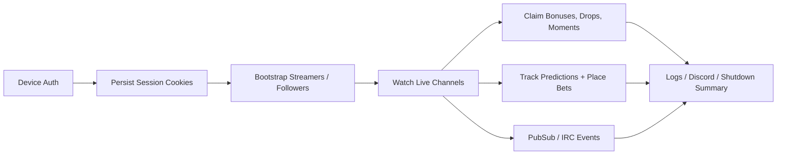

# Twitch Miner Rust

An unofficial Twitch channel points miner rebuilt in Rust as a rewrite of [0x8fv/Twitch-Channel-Points-Miner](https://github.com/0x8fv/Twitch-Channel-Points-Miner), with the goal of keeping the useful behavior while making the codebase easier to reason about, test, ship, and operate.

This project keeps the behavior that matters in day-to-day use:

- device-code login with persisted cookies
- automatic bonus chest claims
- minute-watched farming and streak handling
- prediction betting with configurable strategies and delays
- drops, raids, chat-presence, Discord notifications, and privacy-aware logging
- Docker-friendly runtime layout and multi-arch delivery paths

It is not a toy rewrite. The workspace is split into focused crates, the Twitch parsers are fixture-backed, and the runtime is organized around a single-writer state model instead of a pile of ad-hoc side effects.

## Why this rewrite exists

The point was not to rewrite working behavior for the sake of language preference. The point was to keep the miner useful while making the internals less fragile.

- `tm-runtime` owns mutable state instead of scattering it across the process
- `tm-domain` keeps decision logic pure and testable
- `tm-twitch`, `tm-pubsub`, and `tm-irc` isolate protocol boundaries
- `tm-auth` and `tm-config` make startup, persistence, and local operation predictable
- `tm-observability` keeps logging, anonymization, and Discord plumbing out of the hot path

## What it does



## Quick start

### Local

```powershell
cd C:/Users/ancha/Documents/Projects/TwitchMiner/Twitch-Miner-Rust
cargo run -p tm-app -- --config ./data/config.json --data-dir ./data
```

On first launch:

1. Set `username` in `data/config.json`.
2. Start the app.
3. Open `https://www.twitch.tv/activate`.
4. Enter the device code shown in the terminal.
5. Wait for cookies to be written to `data/cookies/<username>.json`.

### Docker

```powershell
cd C:/Users/ancha/Documents/Projects/TwitchMiner/Twitch-Miner-Rust
docker compose up --build
```

The container layout is centered on `/data`:

- `/data/config.json`
- `/data/cookies/<username>.json`
- `/data/log/*.log`

Published images are static Rust binaries in a `scratch` runtime. The image has no shell, package manager, or OS certificate bundle; TLS trust comes from the Rust dependencies configured in the app. The runtime contract stays centered on `/data` with `TCPM_DATA_DIR=/data`, `TCPM_CONFIG=/data/config.json`, and `SIGTERM` shutdown.

There is also a named-volume variant in [deploy/docker-compose.volume.yml](deploy/docker-compose.volume.yml).

GitHub Actions publishes the multi-arch GHCR image on pushes to `main` and `v*` tags. For local Docker validation, `scripts/build-multiarch.ps1` builds and loads a single local-platform image by default; pass `-Push` to build and publish `linux/amd64`, `linux/arm64`, and `linux/arm/v7`.

## Configuration

The miner will create and extend its config automatically, but a minimal manual setup looks like this:

```json
{
  "username": "your-twitch-username",
  "auto_update": false,
  "streamers": ["StreamerHouse"],
  "claim_drops": true,
  "claim_drops_startup": true,
  "community_goals": false,
  "privacy": {
    "anonymize_logs": false
  }
}
```

Notes:

- `password` is a legacy compatibility field and should be left empty.
- `disable_ssl_cert_verification` is intentionally unsupported and will be rejected at startup/config validation.

Important paths:

- config: `data/config.json`
- cookies: `data/cookies/<username>.json`
- optional logs: `data/log/`
- the repo also ignores local root runtime paths such as `./config.json`, `./cookies/`, `./log/`, `.env*`, and updater temp files

## Workspace map

| Crate | Responsibility |
| --- | --- |
| `tm-app` | process bootstrap, lifecycle, scheduling glue |
| `tm-auth` | device auth, session loading, cookie persistence |
| `tm-config` | config creation, resolution, normalization, write-back |
| `tm-domain` | pure logic, prediction math, shared types |
| `tm-irc` | Twitch IRC transport and chat events |
| `tm-observability` | logging, anonymization, Discord payloads |
| `tm-pubsub` | PubSub batching, parsing, connection handling |
| `tm-runtime` | single-writer runtime state |
| `tm-twitch` | Twitch HTTP, GQL, scraping, parser contracts |
| `tm-updater` | release lookup and binary replacement |

## Project status

The public repo docs focus on operating and understanding the Rust implementation:

- operator guide: [docs/behavior-parity/operator-guide.md](docs/behavior-parity/operator-guide.md)
- container usage: [docs/behavior-parity/container-usage.md](docs/behavior-parity/container-usage.md)
- architecture notes: [docs/architecture/README.md](docs/architecture/README.md)
- container deployment notes: [docs/architecture/container-deployment.md](docs/architecture/container-deployment.md)

## Validation

The workspace has been exercised with:

```powershell
cargo fmt --all
cargo test --workspace --quiet
cargo clippy --workspace -- -D warnings
cargo test --manifest-path tests/contract/Cargo.toml --quiet
cargo clippy --manifest-path tests/contract/Cargo.toml -- -D warnings
cargo test --manifest-path tests/integration/Cargo.toml --quiet
cargo clippy --manifest-path tests/integration/Cargo.toml -- -D warnings
```

## Safety notes

- This project is unofficial and may carry Twitch account or campaign-rule risk.
- Use a dedicated Twitch account if that risk matters to you.
- Do not commit `data/` or cookie files.
- Cookie files contain authentication material; treat them like credentials.
- The app uses device-code login and does not need your Twitch password.
- TLS certificate verification is always enforced; insecure certificate bypass is not supported.
- Keep `auto_update=false` for manual source builds.
- The repo ignores runtime data and logs by default.
- This project is unofficial and not affiliated with Twitch.
- You are responsible for how and where you use it.
- See [SECURITY.md](SECURITY.md) for the credential and reporting model.

## License

Licensed under the [GNU General Public License v3.0 or later](LICENSE).
