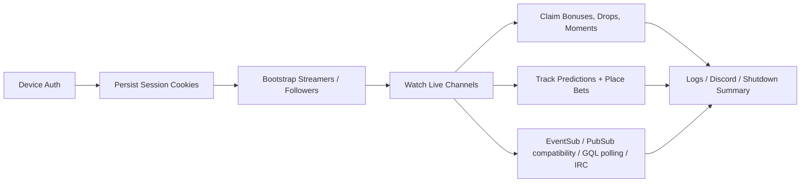

# Twitch Miner Rust

An unofficial Twitch channel points miner rebuilt in Rust as a rewrite of [0x8fv/Twitch-Channel-Points-Miner](https://github.com/0x8fv/Twitch-Channel-Points-Miner), with the goal of keeping the useful behavior while making the codebase easier to reason about, test, ship, and operate.

This project keeps the behavior that matters in day-to-day use:

- device-code login with persisted cookies
- automatic bonus chest claims
- minute-watched farming and streak handling
- prediction betting with configurable strategies and delays
- campaign-aware drop-priority watching and claims, raid observation,
  chat-presence, Discord notifications, and privacy-aware logging
- Docker-friendly runtime layout and multi-arch delivery paths

It is not a toy rewrite. The workspace is split into focused crates, the Twitch parsers are fixture-backed, and the runtime is organized around a single-writer state model instead of a pile of ad-hoc side effects.

## Why this rewrite exists

The point was not to rewrite working behavior for the sake of language preference. The point was to keep the miner useful while making the internals less fragile.

- one serialized runtime state owns mutable data instead of scattering it across the process
- decision logic stays pure and testable
- protocol boundaries remain isolated from domain state
- startup, persistence, and local operation use explicit contracts
- logging, anonymization, and Discord plumbing stay outside the hot path

## What it does


```mermaid
flowchart LR
    A["Device Auth"] --> B["Persist Session Cookies"]
    B --> C["Bootstrap Streamers / Followers"]
    C --> D["Watch Live Channels"]
    D --> E["Claim Bonuses, Drops, Moments"]
    D --> F["Track Predictions + Place Bets"]
    D --> G["EventSub / PubSub compatibility / GQL polling / IRC"]
    E --> H["Logs / Discord / Shutdown Summary"]
    F --> H
    G --> H
```

## Quick start

### Local

The repository includes a credential-free, tracked template at
[`config.example.json`](config.example.json). The runtime config belongs under
`data/`, which is intentionally ignored so cookies and local settings cannot be
committed. Start from a clean clone with this copy/edit/validate/run sequence:

```powershell
cd Twitch-Miner-Rust
New-Item -ItemType Directory -Force ./data | Out-Null
Copy-Item ./config.example.json ./data/config.json
notepad ./data/config.json
cargo run -p tm-app -- --config ./data/config.json --data-dir ./data --check-config
cargo run -p tm-app -- --config ./data/config.json --data-dir ./data
```

Replace both placeholder logins (`your_twitch_login` and
`your_twitch_streamer`) before the validation command. `--check-config` only
loads and validates the file; it does not contact Twitch or require cookies.
The final command starts the miner and therefore performs the normal device-code
login when no saved session exists. On first launch:

1. Confirm the `username` and `streamers` values in `data/config.json` are real
   Twitch logins.
2. Start the app.
3. Open `https://www.twitch.tv/activate`.
4. Enter the device code shown in the terminal.
5. Wait for cookies to be written to `data/cookies/<username>.json`.

`username` is a Twitch login, not a display name: ASCII letters, digits, and
underscores only, with a maximum of 25 characters. It is normalized to
lowercase before the cookie filename is created. Windows device basenames such
as `CON`, `AUX`, `COM1`, and `LPT1` are rejected on every platform so the same
data directory remains portable.

### Docker

```powershell
cd Twitch-Miner-Rust
New-Item -ItemType Directory -Force ./data | Out-Null
Copy-Item ./config.example.json ./data/config.json
notepad ./data/config.json
docker compose config --quiet
docker compose up --build
```

Use the same placeholder replacement and `--check-config` validation shown in
the local sequence before starting the container. Compose validation parses the
checked-in service definition without starting a container or contacting Twitch.

The container layout is centered on `/data`:

- `/data/config.json`
- `/data/cookies/<username>.json`
- `/data/log/*.log`

Published images are static Rust binaries in a `scratch` runtime. The image has no shell, package manager, or OS certificate bundle; TLS trust comes from the Rust dependencies configured in the app. `docker exec` still works when it invokes `/twitch-miner` directly, but `docker exec ... sh` or `bash` cannot work in `scratch`. The runtime contract stays centered on `/data` with `TCPM_DATA_DIR=/data`, `TCPM_CONFIG=/data/config.json`, and `SIGTERM` shutdown.

There is also a named-volume variant in [deploy/docker-compose.volume.yml](deploy/docker-compose.volume.yml).

For Linux bind mounts, make sure the mounted data directory and any existing cookie files stay writable by the container user. The Raspberry Pi example in [deploy/docker-compose.rpi.yml](deploy/docker-compose.rpi.yml) pins a host UID/GID override for that reason.

GitHub Actions builds and publishes the multi-arch GHCR image on pushes to
`main`. A signed `v*` tag promotes the already-tested manifest for that exact
commit without rebuilding it, and fails if the release tag does not retain the
same digest. For local Docker validation, `scripts/build-multiarch.ps1` builds
and loads a single local-platform image by default; pass `-Push` to build and
publish `linux/amd64`, `linux/arm64`, and `linux/arm/v7`.

Deploy published images by immutable digest. See [docs/release-process.md](docs/release-process.md) for the release, Pi update, health, and rollback procedure.

## Configuration

For manual setup, use the credential-free tracked
[`config.example.json`](config.example.json) as the canonical template. Copy
it to `data/config.json`, replace both login placeholders, and run the
network-free `--check-config` command from [Quick start](#quick-start).

When the configured file does not exist, the app can create one from its
built-in defaults and extend existing files during migration. That generated
fallback is not a second starter template: values can differ from the tracked
example (the historical `betting(make_predictions)` field, for example, is
enabled by the built-in default but disabled in the safe template). The field
name is retained for Go/Python lineage and config compatibility; set it to
`true` only when prediction betting is intended, and keep the spelling when
editing the file.

Notes:

- Empty legacy `password`, `disable_ssl_cert_verification=false`, and the unused
  `watch_queue_logging` flag are migrated away. Non-empty passwords and disabled
  TLS verification remain fail-closed validation errors.
- Prediction bet percentages must be `0`-`100`; each stake is bounded by
  Twitch's `10`-point minimum and `250000`-point per-viewer maximum, and an
  explicit `bet.max_points` above that maximum is rejected. Delays must be
  finite and non-negative, and `PERCENTAGE` delay mode accepts `0`-`1`.
  Invalid values are rejected before runtime.
- Operational settings are summarized in the
  [operator guide](docs/behavior-parity/operator-guide.md). The
  [protocol inventory](docs/protocol-inventory.md) is the normative source for
  playback, transport, mutation, campaign, and recovery behavior.

Important paths:

- config: `data/config.json`
- cookies: `data/cookies/<username>.json`
- optional logs: `data/log/`
- bounded streak metadata cache: `data/streak-cache.json` (no auth material)
- the repo also ignores local root runtime paths such as `./config.json`, `./cookies/`, `./log/`, and `.env*`

`auto_update` was removed. A legacy `false` value is migrated away; `true` is rejected.
Use `tm-app --check-config --data-dir ./data` to preview a migration without writing.
Use `tm-app --check-config --json --data-dir ./data` for scripts, and
`tm-app --status --data-dir ./data` for a sanitized human-readable status file.

## Workspace map

The canonical crate ownership and dependency-direction map lives in
[docs/architecture/README.md](docs/architecture/README.md), together with the
request-to-reward event flow and source pointers.

## Project status

The public repo docs focus on operating and understanding the Rust implementation:

- operator guide: [docs/behavior-parity/operator-guide.md](docs/behavior-parity/operator-guide.md)
- container usage: [docs/behavior-parity/container-usage.md](docs/behavior-parity/container-usage.md)
- architecture notes: [docs/architecture/README.md](docs/architecture/README.md)
- behavioral differences and limits, including typed playback-token/HLS
  preflight: [docs/behavior-parity/parity-matrix.md](docs/behavior-parity/parity-matrix.md)
- protocol inventory and canary: [docs/protocol-inventory.md](docs/protocol-inventory.md)
- release and rollback: [docs/release-process.md](docs/release-process.md)
- signed release evidence template: [docs/release-record-template.md](docs/release-record-template.md)
- performance measurement: [docs/performance.md](docs/performance.md)
- Go/Python-to-Rust data migration: [docs/migration.md](docs/migration.md)

## Validation

The workspace has been exercised with:

```powershell
cargo fmt --all -- --check
cargo test --workspace --all-targets --all-features --locked
cargo clippy --workspace --all-targets --all-features --locked -- -D warnings
cargo build --workspace --release --locked
./scripts/verify-architecture.ps1
./scripts/verify-build-integrity.ps1
./scripts/verify-go-baseline.ps1 -GoRoot ../Twitch-Channel-Points-Miner
```

The Go baseline gate requires Go 1.21+ and is run when the adjacent reference
checkout is available; the Rust-only commands remain reproducible from this
repository alone.

The running process writes a privacy-safe `runtime-status.json` in the data
directory. `twitch-miner --health` checks process and task freshness; Docker
uses that command as its health check. `tm-app --support-bundle ./support.json`
writes version/status and file-count metadata without cookies, config values, or log contents.
Transport ownership and fallback behavior are defined in the
[protocol inventory](docs/protocol-inventory.md).

## Safety notes

- This project is unofficial and may carry Twitch account or campaign-rule risk.
- Use a dedicated Twitch account if that risk matters to you.
- Do not commit `data/` or cookie files.
- Cookie files contain authentication material; treat them like credentials.
- On Windows, keep the data directory under a user-private profile directory;
  the app relies on inherited Windows ACLs rather than changing them.
- The app uses device-code login and does not need your Twitch password.
- TLS certificate verification is always enforced; insecure certificate bypass
  is not supported. Optional IRC uses verified TLS on port 6697 and never sends
  the OAuth token over plaintext IRC.
- Requests to Twitch-supplied playback and telemetry URLs intentionally bypass
  system proxies so redirect and DNS-address validation cannot be bypassed.
- Run `tm-app --canary --data-dir ./data` on a dedicated account before publishing a release.
- The repo ignores runtime data and logs by default.
- This project is unofficial and not affiliated with Twitch.
- You are responsible for how and where you use it.
- See [SECURITY.md](SECURITY.md) for the credential and reporting model.

## License

Licensed under the [GNU General Public License v3.0 or later](LICENSE).
