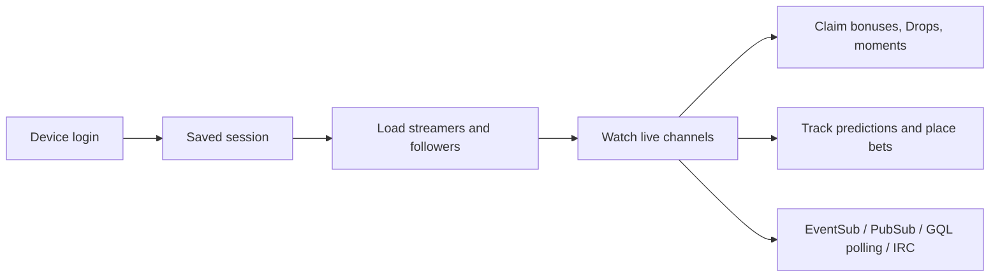

# Twitch Miner Rust

<p align="center">
<a href="https://github.com/FueledByRedBull/Twitch-Miner-Rust/actions/workflows/ci.yml"></a>
<a href="LICENSE"></a>
<a href="rust-toolchain.toml"></a>
<a href="https://github.com/FueledByRedBull/Twitch-Miner-Rust/pkgs/container/twitch-miner-rust"></a>
</p>

An unofficial Twitch channel-points miner written in Rust. It watches the
channels you choose and collects channel points, bonus chests, watch streaks,
and Drops, with optional prediction betting. It runs unattended as a small,
self-supervising service on a Raspberry Pi, a server, or your desktop.

> [!WARNING]
> This project is not affiliated with Twitch. Automating an account may break
> Twitch's rules or campaign terms, so use a dedicated account if that risk
> matters to you. See [SECURITY.md](SECURITY.md).

## Features

- **Channel points**: watches up to two channels at a time (the number Twitch
  credits at once) and claims bonus chests automatically.
- **Watch streaks**: prioritizes channels whose streak is at risk and can
  recover a missed streak from a recent VOD or clip.
- **Drops**: prefers channels with an unfinished, earnable Drop campaign and
  claims rewards when they are ready.
- **Predictions** (off by default): configurable strategies,
  filters, delays, and stake limits.
- **Extras**: raid following, moments, community goals, chat presence, and
  Discord notifications.
- **Safe defaults**: device-code login (no password), private credential files,
  always-verified TLS, and a privacy mode for logs.
- **Unattended operation**: built-in health check, sanitized status output, and
  automatic task recovery, shipped as a static binary in a `scratch` image for
  AMD64 and ARM64.

## Quick start (Docker)

You need Docker with Compose and a Twitch account.

1. Clone the repository and create your configuration:

   ```sh
   git clone https://github.com/FueledByRedBull/Twitch-Miner-Rust.git
   cd Twitch-Miner-Rust
   mkdir -p data
   cp config.example.json data/config.json
   ```

2. Edit `data/config.json`: replace `your_twitch_login` with your Twitch login
   and `your_twitch_streamer` with the channels you want to watch.

3. Build and start the miner:

   ```sh
   docker compose up --build
   ```

4. On first start the log shows a device code. Open
   <https://www.twitch.tv/activate>, enter the code, and the miner saves your
   session to `data/cookies/<username>.json`. Later starts reuse it.

<details>
<summary>Windows (PowerShell)</summary>

```powershell
git clone https://github.com/FueledByRedBull/Twitch-Miner-Rust.git
cd Twitch-Miner-Rust
New-Item -ItemType Directory -Force data | Out-Null
Copy-Item config.example.json data/config.json
notepad data/config.json
docker compose up --build
```

</details>

On Linux the container runs as UID/GID `1000:1000`, so `data/` must be writable
by that user. To deploy a published image by digest, run on a Raspberry Pi, or
use the Windows ZIP/MSI build, see the [operations guide](docs/operations.md).

## Run from source

Install Rust with [rustup](https://rustup.rs/); the pinned toolchain in
`rust-toolchain.toml` is selected automatically.

```sh
cargo run --release -p tm-app -- --config data/config.json --data-dir data --check-config
cargo run --release -p tm-app -- --config data/config.json --data-dir data
```

`--check-config` validates the file without contacting Twitch. The second
command starts the miner and performs the device-code login if no session is
saved.

## Everyday commands

The binary is `tm-app` when built with Cargo and `/twitch-miner` inside the
container. Pass `--data-dir` so it finds your configuration and session.

| Option | What it does |
| --- | --- |
| `--check-config` | Validate the configuration and preview migrations without contacting Twitch. Add `--json` for scripts. |
| `--status` | Print the sanitized runtime status: tasks, transports, and earning state. |
| `--health` | Exit successfully only while the running miner's tasks are healthy. Docker uses this as its health check. |
| `--support-bundle <path>` | Write a privacy-safe support file without cookies, configuration values, or logs. |
| `--canary` | Run read-only live checks on a dedicated account before a release. |

In Docker, run them through Compose:

```sh
docker compose exec -T twitch-miner /twitch-miner --status --data-dir /data
```

## Configuration

[`config.example.json`](config.example.json) lists every setting, and the
[configuration reference](docs/configuration.md) explains each one. The miner
keeps everything under its data directory:

| Path | Contents |
| --- | --- |
| `config.json` | Your settings |
| `cookies/<username>.json` | Your Twitch session. Treat it like a password. |
| `log/` | Optional saved logs |
| `streak-cache.json`, `prediction-placements.json`, `runtime-status.json` | Runtime state; no credentials |

Coming from the Go or Python miner? The [migration guide](docs/migration.md)
explains which settings and sessions carry over.

## How it works


```mermaid
flowchart LR
    A["Device login"] --> B["Saved session"]
    B --> C["Load streamers and followers"]
    C --> D["Watch live channels"]
    D --> E["Claim bonuses, Drops, moments"]
    D --> F["Track predictions and place bets"]
    D --> G["EventSub / PubSub / GQL polling / IRC"]
```

One runtime component owns all mining state. Transports and watchers report
typed events to it, and network actions run only after it decides on them.
See the [architecture overview](docs/architecture.md).

## Documentation

| I want to... | Read |
| --- | --- |
| Run, update, or monitor the miner | [Operations guide](docs/operations.md) |
| Look up a setting | [Configuration reference](docs/configuration.md) |
| Move from the Go or Python miner | [Migration guide](docs/migration.md) |
| Understand the design | [Architecture](docs/architecture.md) |
| Know exactly what it sends to Twitch | [Protocol inventory](docs/protocol-inventory.md) |
| Compare it with the Go and Python miners | [Parity matrix](docs/parity-matrix.md) |
| Contribute code | [CONTRIBUTING.md](CONTRIBUTING.md) |
| Publish a release (maintainers) | [Release process](docs/release-process.md) |
| Report a vulnerability | [SECURITY.md](SECURITY.md) |
| See what changed | [CHANGELOG.md](CHANGELOG.md) |

## Credits

Mining behavior follows the lineage of
[Tkd-Alex/Twitch-Channel-Points-Miner-v2](https://github.com/Tkd-Alex/Twitch-Channel-Points-Miner-v2),
its maintained [rdavydov fork](https://github.com/rdavydov/Twitch-Channel-Points-Miner-v2),
and the [0x8fv Python fork](https://github.com/0x8fv/Twitch-Channel-Points-Miner-v2).
Behavioral parity is checked against 0x8fv's
[Go port](https://github.com/0x8fv/Twitch-Channel-Points-Miner) with shared test
vectors.

## License

[GNU General Public License v3.0 or later](LICENSE).
