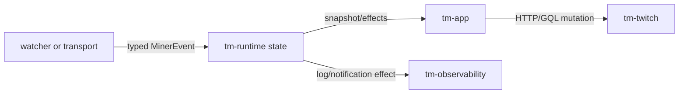

# Architecture

The project runs as a Cargo workspace with crate boundaries split by
responsibility:

- `tm-app` owns process bootstrap and task wiring.
- `tm-config` owns config/path resolution and write-back; typed streamer-setting
  composition is isolated from persistence and migration.
- `tm-auth` owns cookie persistence and device auth helpers.
- `tm-domain` owns pure logic, shared types, and the transport-neutral
  `MinerEvent` contract.
- `tm-twitch` owns Twitch HTTP, GQL, and scraping contracts. HTTP execution and
  typed response normalization remain separate modules.
- `tm-pubsub` owns the isolated PubSub `/v1` compatibility client and EventSub
  WebSocket transport. Production uses the fixed viewer-compatible topic set;
  an authenticated broadcaster may additionally use EventSub prediction topics.
  EventSub connection lifecycle, capacity planning, and protocol normalization
  are separate modules behind one facade.
- `tm-irc` owns IRC protocol handling.
- `tm-runtime` owns the single-writer runtime state model.
- `tm-observability` owns logging, privacy helpers, and Discord webhook payloads.

Discord is the sole built-in outbound notifier. Generic notifier backends and
analytics exporters are intentionally out of scope unless a concrete operator
requirement justifies adding them.

## Event flow

For an ordinary WATCH credit, `tm-pubsub` parses the authenticated
`points-earned` message into `MinerEvent::PointsEarned`; the runtime updates
the tracked streamer and emits no network effect. Predictions use the same
boundary but can return an evaluation effect for `tm-app` to execute once.

Source pointers: [runtime state](../../crates/tm-runtime/src/state.rs),
[runtime handle](../../crates/tm-runtime/src/handle.rs),
[PubSub parser](../../crates/tm-pubsub/src/parse.rs),
[EventSub parser](../../crates/tm-pubsub/src/eventsub/protocol.rs), and
[effect execution](../../crates/tm-app/src/runtime_effects.rs).

## Internal module layout

The largest crates are decomposed behind stable crate facades:

- `tm-app` keeps `main.rs` as the executable entrypoint and splits orchestration
  into startup, shutdown, drops, independently supervised EventSub/PubSub tasks,
  presence fallback polling, runtime effects, context refresh, minute watching,
  chat, and shared utilities.
- `tm-config` keeps the stable flat schema and atomic persistence in `lib.rs`;
  `settings.rs` owns typed base/override composition.
- `tm-twitch` exposes the same public API from `lib.rs`; `client.rs` owns HTTP
  execution and bounded retry policy, while `responses.rs` owns strict typed
  response validation and normalization.
- `tm-pubsub` exposes the same public API from `lib.rs`; `eventsub.rs` owns the
  connection/subscription lifecycle, `eventsub/planning.rs` owns deterministic
  cost planning, and `eventsub/protocol.rs` owns wire validation, normalization,
  and bounded message deduplication.
- `tm-runtime` exposes the same public API from `lib.rs` while separating the
  serialized handle, runtime state/types, effects, prediction settlement
  helpers, and summary/history formatting.

Large private unit-test suites live under each crate's `tests/unit/` directory
and are included with `cfg(test)` path modules. They retain private access
without becoming integration targets or forcing test hooks into public APIs.

## Runtime ownership and effects

All mutable mining state remains owned by one serialized `tm-runtime` state.
Transport, polling, and watcher tasks submit typed events/updates and receive
snapshots or effect decisions; they never retain a second mutable copy. The reducer
deduplicates external mutation identifiers before returning effects. Network
mutations are executed once by `tm-app` after the runtime decision and are never
silently replayed.

Application orchestration uses contexts only where values share a lifecycle:
EventSub, PubSub, runtime-effect execution, minute watching, and offline streak
recovery. Startup, canary, and CLI paths are split by preparation, decision,
and execution responsibility. Flat serialized config structures and exhaustive
state/watch reducers stay explicit because wrapping them solely to satisfy a
line or boolean count would obscure the contract.

EventSub and PubSub task contexts embed the same `RuntimeEffectContext` used to
execute runtime-approved network effects. This removes duplicated runtime/client/
identity/observability/health wiring while leaving transport credentials and
subscription state in their narrower transport contexts.

## Enforced invariants

| Boundary | Invariant |
| --- | --- |
| Domain | `tm-domain` remains deterministic and has no async, HTTP, transport, tracing, CLI, or application dependency. |
| Runtime | One serialized state owner applies updates, and reducers emit effects without executing network mutations. |
| Twitch HTTP | Only classified read operations retry; mutations are not replayed after an uncertain response. |
| Transports | EventSub, PubSub, IRC, and polling are independently supervised and cannot directly own runtime state. |
| Watching | At most two Twitch-creditable slots run; an eligible campaign can pin one while the remaining slot fair-rotates. |
| Privacy | Credentials, identifiers, balances, and raw responses do not cross privacy-safe diagnostic interfaces. |
| Lifecycle | Health belongs to the current process session, and shutdown uses normal signal-driven task termination. |

`scripts/verify-architecture.ps1` checks the allowed internal Cargo dependency
graph, rejects network/application dependencies in `tm-domain`, and prevents
substantial `*_tests.rs` files from returning to production source trees. CI
runs it without installing another analysis dependency.

Production workspace code forbids `unsafe`. CI also rejects production
`unwrap`, `expect`, panic, `todo!`, and `unimplemented!` shortcuts, except for
narrowly documented compile-time invariants such as the built-in default-config
schema. Test fixtures may still fail loudly.

Quality gates are handled by `.github/workflows/ci.yml`; Docker image validation and publishing remain in the multiarch workflow. Automatic self-update is intentionally absent: releases are source- and digest-pinned.
