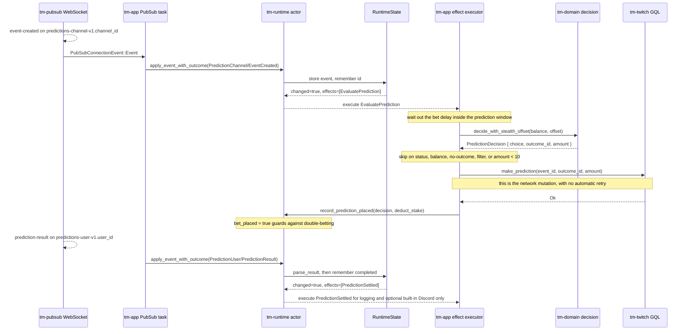

# One prediction, placed and settled — the effect loop

This is the companion to [the WATCH walkthrough](walkthrough.md). A `WATCH`
reward is the *effect-free* path: the reducer updates local points and returns
no `RuntimeEffect`. A prediction is the opposite — it is the canonical
**actor → effect → network-mutation** loop, so it is the best trace for
understanding how the miner performs writes against Twitch.

The most important distinction is again temporal: placement and settlement
happen separately, but only placement mutates Twitch:

- **Placement** is a *mutation*. When a prediction opens, the actor decides a
  bet is warranted and emits an effect; the application later attempts one
  `MakePrediction` GraphQL mutation. `tm-app` does not automatically retry a
  failed or interrupted mutation.
- **Settlement** is *accounting*. When the prediction resolves, the reducer
  computes the outcome with bounded integer accounting and emits a
  `PredictionSettled` effect that only logs and optionally notifies. It performs
  no network mutation.

## The path at a glance



`channel_id` is the broadcaster; `user_id` is the authenticated viewer. Channel
prediction lifecycle events arrive on `predictions-channel-v1.<channel_id>`; the
viewer's own confirmation and result arrive on `predictions-user-v1.<user_id>`.

## 1. A channel prediction opens

Under `TransportSourcePolicy::viewer_compatibility` the topic builder subscribes
to `predictions-channel-v1.<channel_id>` for each tracked streamer. When a
prediction opens, `tm-pubsub` parses the envelope into
`tm_events::MinerEvent::PredictionChannel { kind: EventCreated, event, .. }`,
where `event` is a typed `tm_domain::PredictionEvent` carrying the event ID,
status, prediction window, and outcomes.

The `tm-app` PubSub task submits it with `apply_event_with_outcome`. In
[`RuntimeState`](../../crates/tm-runtime/src/state.rs) the `EventCreated` arm
returns **unchanged** unless every guard passes:

- the event ID is non-empty and the status is `ACTIVE`;
- the streamer has `make_predictions` enabled; and
- the event ID has not already been processed (`remember_mutation_id`).

For a first, active, opted-in prediction it stores the event in
`self.predictions` and returns a single effect,
`RuntimeEffect::EvaluatePrediction { event_id }`. Note what did *not* happen:
the reducer did not decide, did not touch the balance, and did not call the
network. It only recorded state and requested an evaluation.

## 2. The effect executor decides and places the bet

This step is the whole point of the walkthrough: a reducer-emitted effect turns
into one network mutation.

[`evaluate_prediction_after_delay`](../../crates/tm-app/src/runtime_effects.rs)
first computes `prediction_wait_duration` and `tokio::time::sleep`s for it, so
the bet lands late in the prediction window (more information, per the
configured bet delay) rather than the instant the event opens. It then calls
`evaluate_prediction`, which takes a fresh runtime snapshot and **stops early**
if the event is gone, `bet_placed` is already true, or a result is already
recorded. Together with the processed-event ID set, this prevents duplicate
placement attempts while the process is tracking the event.

It then resolves the current streamer and applies the skip ladder, in order:

1. `maybe_skip_prediction_for_status` — the event is no longer active;
2. `maybe_skip_prediction_for_balance` — insufficient balance;
3. `decide_with_stealth_offset(streamer.channel_points, stealth_offset)` — the
   pure `tm-domain` decision (exact `i128` stake math, strategy selection, and a
   bounded stealth offset chosen once per event via
   `prediction_stealth_offset`). An empty `outcome_id` means no outcome was
   selectable, so it skips;
4. `should_skip_by_filter` — the optional `filter_condition` is not satisfied;
5. `amount < 10` — below Twitch's minimum stake.

Only if none of those skip does it call
[`place_prediction`](../../crates/tm-app/src/runtime_effects.rs), which performs
the mutation:

```text
tm-twitch::make_prediction(event_id, decision.outcome_id, decision.amount)
```

On `Ok`, it records a bet in health and calls
`RuntimeHandle::record_prediction_placed(event_id, decision, deduct_stake)`. That
bounded actor command sets `bet_placed = true` (so a later `EventUpdated` or a
re-delivery cannot double-bet) and, when `deduct_stake_on_place` is true
(default), optimistically debits the stake locally. The reducer never runs the
mutation, and the application does not silently retry it. This is process-local
duplicate prevention, not a claim of distributed exactly-once delivery across
a crash between Twitch accepting the request and local state recording it.

## 3. Twitch confirms the bet

Separately, the viewer's own `predictions-user-v1.<user_id>` topic delivers a
prediction-made confirmation, parsed as
`MinerEvent::PredictionUser { kind: PredictionMade, .. }`. A successful local
placement already records both `bet_placed` and `bet_confirmed`, so this later
message is normally an idempotent no-op; if confirmation was not yet recorded,
the reducer sets `bet_confirmed = true` and returns with **no effect**. This is
bookkeeping that the wager was accepted; it is distinct from placing it.

## 4. The prediction resolves and is accounted

Settlement can arrive two ways, and both converge on the same math:

- the channel event resolves (`PredictionChannel { kind: EventUpdated, .. }`
  with a `winning_outcome_id`), handled by
  `build_prediction_settlement_effect`; or
- the viewer result arrives
  (`PredictionUser { kind: PredictionResult, result }`).

For the viewer result, the reducer reads `type` (`WIN`, `LOSE`, or `REFUND`) and
`points_won`, ignores anything else, removes the event from
`self.predictions`, and calls
[`PredictionEvent::parse_result`](../../crates/tm-domain/src/prediction.rs). That
pure function computes `gained = won - placed` (with `REFUND` zeroing both) using
exact integer math and builds the `result_string` and `decision_label`.

The reducer then emits `RuntimeEffect::PredictionSettled { event_id,
streamer_username, title, decision_label, result_type, result_string }` and
remembers the completed prediction (so a duplicate result is idempotent). The
effect executor logs the settlement under the `make_predictions` operation and
maps it to the optional built-in Discord notification. **No network mutation runs for
settlement** — unlike placement, the accounting stays local.

## Why this differs from WATCH

| | WATCH | Prediction |
| --- | --- | --- |
| Reducer output | applies gain, `effects: []` | stores event, `effects: [EvaluatePrediction]`; later `[PredictionSettled]` |
| Network write | none | one `make_prediction` attempt; no automatic retry |
| Decision logic | none | `tm-domain` decision with exact `i128` math and skip ladder |
| Duplicate safety | dedup replay keys | process-local `bet_placed` guard + processed-id set + no automatic mutation retry |

The prediction path is therefore the one to read to understand the write side of
the runtime: the single-writer actor decides *what* should happen and emits a
typed effect, and `tm-app` is the only place that turns that effect into a
Twitch mutation.

## Where to read next

- Prediction topics: [`tm-pubsub/src/topics.rs`](../../crates/tm-pubsub/src/topics.rs)
- Typed event boundary: [`tm-events/src/lib.rs`](../../crates/tm-events/src/lib.rs)
- Reducer and settlement wiring: [`tm-runtime/src/state.rs`](../../crates/tm-runtime/src/state.rs)
- Effect definitions: [`tm-runtime/src/effect.rs`](../../crates/tm-runtime/src/effect.rs)
- Decision and settlement math: [`tm-domain/src/prediction.rs`](../../crates/tm-domain/src/prediction.rs)
- Effect execution and the mutation: [`tm-app/src/runtime_effects.rs`](../../crates/tm-app/src/runtime_effects.rs)
- Bet placement GraphQL: [`tm-twitch/src/operations.rs`](../../crates/tm-twitch/src/operations.rs)
