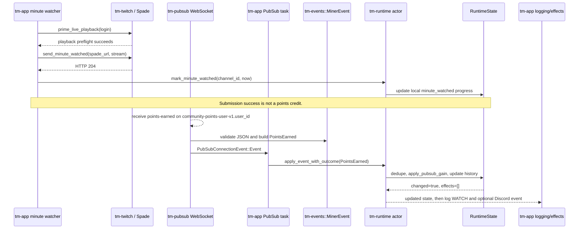

# One ordinary WATCH reward, end to end

This is a newcomer-oriented trace of one ordinary channel-points reward. It
uses the current viewer-compatibility transport policy and follows a
`reason_code` of `WATCH`.

The most important distinction is temporal:

- The minute watcher submits a `minute-watched` playback/telemetry request.
  Only a `204 No Content` response lets the miner advance its **local watch
  progress**.
- Twitch may later publish a separate `points-earned` message. That message
  is the **credited WATCH reward**. These code paths do not expose a
  correlation ID linking a PubSub message to a particular minute-watch
  request, so this walkthrough follows the ordinary event shape without
  claiming a one-to-one delivery guarantee.

## The path at a glance

The `user_id` in the topic is the authenticated viewer's ID. It is shown as a
placeholder above; it is not a channel ID.

## 1. The minute watcher submits watch telemetry

`tm-app` starts the minute watcher when a viewer ID is available. Each pass
gets a runtime snapshot, refreshes stale stream metadata, and selects eligible
watch targets. For one online target,
[`watch_streamer_login`](../../crates/tm-app/src/minute_watcher.rs) calls
`send_minute_watched_for_streamer`.

That function first checks that the cached stream has a broadcast ID and is not
too old. It creates a fresh `Stream` payload with
`build_minute_watched_event`, whose event is `minute-watched` and whose
properties include the channel ID, broadcast ID, viewer ID, `player: "site"`,
`live: true`, and channel login. Drop-enabled watching can add game and game ID
properties.

`tm-twitch` then performs the playback preflight in
[`prime_live_playback`](../../crates/tm-twitch/src/client.rs): it decodes a
typed playback-access-token response, validates the token, fetches the HLS
master and variant playlists, and checks a media segment. This is playback
priming; it is not the points event.

The watcher resolves (or reuses) a Spade URL and
[`minute_watched_request`](../../crates/tm-twitch/src/parsers.rs) serializes the
payload vector, base64-encodes it, URL-encodes the `data` field, and builds the
form request. `send_minute_watched` posts that request to the validated Spade
endpoint. The cache helper uses the cached URL first and, if the status is not
`204 No Content`, refreshes the URL and tries the request once more.

Only a `204` lets the watcher call `RuntimeHandle::mark_minute_watched`. That
bounded actor command invokes `Stream::update_minute_watched` with a 400-second
maximum continuous interval: a positive, recent gap adds elapsed minutes and
every successful mark records the new `last_minute_update`. A stale or backward
gap re-anchors the timestamp without adding progress. This updates local
watch/streak selection state; it does not change `channel_points` or
`history["WATCH"]`.

## 2. Twitch later delivers the credited WATCH event

The application also starts a supervised PubSub loop. Under
`TransportSourcePolicy::viewer_compatibility`, its topic builder always adds
`community-points-user-v1.<user_id>`; this authenticated user topic is where
channel-points gains arrive. EventSub and presence polling may carry other
observations, but the ordinary viewer points event follows this PubSub path.

The WebSocket client parses a `MESSAGE` envelope and then parses its nested
`message` JSON. For a `type` of `points-earned`,
[`parse_points_earned_event`](../../crates/tm-pubsub/src/parse.rs) fails closed
unless it has:

- a non-empty channel ID from the payload;
- a positive `data.point_gain.total_points`;
- a bounded, ASCII `reason_code`, normalized to uppercase; and
- a non-negative `data.balance.balance`.

For the ordinary case, `reason_code: "WATCH"` becomes the typed
`tm_events::MinerEvent::PointsEarned { channel_id, earned, reason, balance }`.
The transport task emits it as `PubSubConnectionEvent::Event`; raw transport
JSON does not cross into the runtime reducer.

## 3. The single writer accounts for the reward

`tm-app`'s PubSub handler records transport health and submits that event with
`RuntimeHandle::apply_event_with_outcome`. The handle waits for capacity in the
bounded runtime queue (capacity 64), so the sole `tm-runtime` actor applies
commands in order. No transport task owns a second mutable points balance.

`RuntimeState::apply_event_with_outcome` handles every `MinerEvent` variant in
one reducer. For `PointsEarned` it:

1. finds the streamer by stable `channel_id`;
2. checks the streamer's recent point-event replay keys and returns unchanged
   for an already-applied event/state combination;
3. calls `apply_pubsub_gain` for a first delivery; and
4. remembers the applied state key before returning
   `EventApplication { changed: true, effects: [] }`.

If the channel ID is not tracked, the reducer returns unchanged and does not
create a new streamer entry.

For a positive ordinary WATCH gain, `apply_pubsub_gain` advances the local
`channel_points` by `earned` (saturating and never lowering a non-negative
gain), marks points as initialized, and updates the `WATCH` history entry's
count and amount. The reported balance is retained in the typed event and in
the replay identity; the reducer's positive-gain accounting is based on the
current local balance. A `WATCH` event has no `RuntimeEffect`: unlike a claim,
raid, or prediction settlement, it does not ask the app to perform another
network mutation. (`WATCH_STREAK` has an additional streak-resolution branch;
ordinary `WATCH` does not.)

The actor notifies state subscribers after a changed event. The PubSub handler
then logs the updated streamer and maps `WATCH` to the optional Discord
`GainForWatch` event. It sends the empty effects list to the effect executor,
which therefore has no network work for this reward. Later session summaries
compare the final balance with the startup snapshot and render the accumulated
history.

For the write side of the runtime — the actor → effect → network-mutation loop
that a `WATCH` reward does not exercise — see the companion
[prediction walkthrough](prediction-walkthrough.md).

## Where to read next

- Minute submission: [`tm-app/src/minute_watcher.rs`](../../crates/tm-app/src/minute_watcher.rs)
- Playback and Spade request code: [`tm-twitch/src/client.rs`](../../crates/tm-twitch/src/client.rs) and [`tm-twitch/src/parsers.rs`](../../crates/tm-twitch/src/parsers.rs)
- PubSub topic and parser: [`tm-pubsub/src/topics.rs`](../../crates/tm-pubsub/src/topics.rs) and [`tm-pubsub/src/parse.rs`](../../crates/tm-pubsub/src/parse.rs)
- Typed event boundary: [`tm-events/src/lib.rs`](../../crates/tm-events/src/lib.rs)
- Actor and reducer: [`tm-runtime/src/actor.rs`](../../crates/tm-runtime/src/actor.rs) and [`tm-runtime/src/state.rs`](../../crates/tm-runtime/src/state.rs)
- Points accounting and summaries: [`tm-runtime/src/summary.rs`](../../crates/tm-runtime/src/summary.rs)
