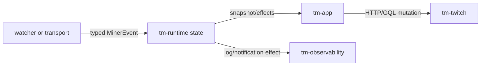

# Architecture walkthrough

The application keeps transport, domain, state, and side effects in separate
owners. `tm-domain` contains the shared `MinerEvent` contract and pure rules;
`tm-pubsub` and `tm-twitch` only parse or perform I/O; `tm-runtime` serializes
state transitions; and `tm-app` supervises tasks and executes effects.

## Ownership map

| Crate | Owns |
| --- | --- |
| `tm-app` | startup, task supervision, polling, effect execution, shutdown |
| `tm-auth` | device login and private session persistence |
| `tm-config` | config schema, path resolution, migration |
| `tm-domain` | `MinerEvent`, streamer state, prediction/watch rules |
| `tm-twitch` | Twitch HTTP/GQL, playback, HLS, and Spade contracts |
| `tm-pubsub` | PubSub/EventSub WebSockets and typed event parsing |
| `tm-irc` | IRC chat transport |
| `tm-runtime` | serialized state updates, reducers, snapshots, effects |
| `tm-observability` | logs, privacy helpers, Discord delivery |

## Event flow

For an ordinary WATCH credit, `tm-pubsub` parses the authenticated
`points-earned` message into `MinerEvent::PointsEarned`; the runtime updates
the tracked streamer and emits no network effect. A prediction follows the
same event boundary but can return an evaluation effect; `tm-app` performs the
single GraphQL mutation and records the result through the runtime handle.

Further detail lives in the [protocol inventory](../protocol-inventory.md).

## Source pointers

- [runtime state](../../crates/tm-runtime/src/state.rs)
- [runtime handle](../../crates/tm-runtime/src/handle.rs)
- [PubSub parser](../../crates/tm-pubsub/src/parse.rs)
- [EventSub parser](../../crates/tm-pubsub/src/eventsub/protocol.rs)
- [effect execution](../../crates/tm-app/src/runtime_effects.rs)
